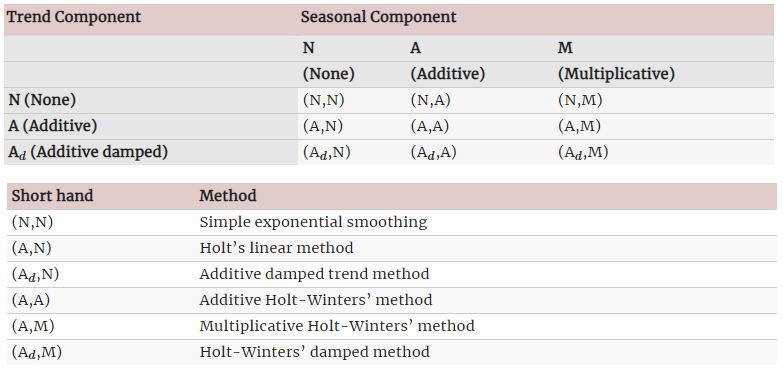

```{r setup, include=FALSE}
knitr::opts_chunk$set(echo = TRUE, warning = FALSE, message = FALSE)
```

## Quem sou eu

-   Bacharelado em Estatística (ENCE, 2013)
-   Mestrado em Eng. Elétrica (PUC-Rio, 2015)
-   Doutorado em Eng. de Produção (PUC-Rio, 2018)
-   Pós-doutorado em Eng. de Produção (PUC-Rio, 2019)
-   Professora Adjunta desde 2019 (DEI, PUC-Rio)

\flushright {width="50%"}

## Me encontre em

-   @paula_macaira
-   github.com/paulamacaira
-   sites.google.com/view/paulamacaira
-   [paulamacaira\@puc-rio.br](mailto:paulamacaira@puc-rio.br){.email}

\flushright {width="40%"}

## Premissas

-   Presumo que você conheça minimamente a **linguagem R** e o meio ambiente **RStudio**
-   Suponho que você seja familiarizado com conceitos como **séries temporais, média, desvio padrão, quantis, regressão, distribuição normal, probabilidade** etc.

## Falaremos sobre...

1.  o que é um tsibble
2.  alguns gráficos de ST
3.  benchmarks para previsão
4.  análise dos resíduos
5.  medidas de acurácia
6.  métodos de Suavização Exponencial
7.  modelos de Box & Jenkins

\center {width="50%"}

## ...

{width="100%"}

## Pacotes necessários

```{r eval = F}
# Manipulação de dados
library(tidyverse)

# Manipulação de Séries Temporais
library(tsibble)

# Funções de Previsão
library(fable)

# Gráficos e Estatísticas de Séries Temporais
library(feasts)

# Séries Temporais Tidy
library(tsibbledata)

# Todos os itens acima e mais
library(fpp3)
```

```{r echo = F}
# Manipulação de dados
library(tidyverse)

# Manipulação de Séries Temporais
library(tsibble)

# Funções de Previsão
library(fable)

# Gráficos e Estatísticas de Séries Temporais
library(feasts)

# Séries Temporais Tidy
library(tsibbledata)

# Todos os itens acima e mais
library(fpp3)
```

## O que é um tsibble

Um tsibble permite o armazenamento e manipulação de múltiplas séries temporais em R

Ele contêm: 

- um index (informação de tempo);
- variáveis medidas; e
- variáveis chave (identificadores únicos opcionais para cada série)

## Alguns exemplos

```{r eval = F}
global_economy
```

\tiny

```{r echo = F}
global_economy
```

## Alguns exemplos

```{r eval = F}
tourism
```

\tiny

```{r echo = F}
tourism
```

## Convertendo um data frame/tibble em tsibble

```{r tidy = F, eval = F}
consumo = readr::read_csv2("https://raw.githubusercontent.com/paulamacaira/Semana-da-Estatistica-2022-UFJF/main/Minicurso-fable/consumo_energia_2022.csv")
consumo
```

\tiny

```{r tidy = F, echo = F}
consumo = readr::read_csv2("https://raw.githubusercontent.com/paulamacaira/Semana-da-Estatistica-2022-UFJF/main/Minicurso-fable/consumo_energia_2022.csv")
consumo
```

O link do arquivo no GitHub é:

"https://raw.githubusercontent.com/paulamacaira/Semana-da-Estatistica-2022-UFJF/main/Minicurso-fable/consumo_energia_2022.csv"

## Convertendo para tsibble

```{r eval = F}
consumo_tsibble = consumo %>%
  mutate(Data = yearmonth(Data)) %>% 
  pivot_longer(-Data, names_to = "Regiao", 
               values_to = "Consumo") %>% 
  as_tsibble(index = Data, key = Regiao)
consumo_tsibble
```

## Convertendo para tsibble

```{r echo = F}
consumo_tsibble = consumo %>%
  mutate(Data = yearmonth(Data)) %>% 
  pivot_longer(-Data, names_to = "Regiao", 
               values_to = "Consumo") %>% 
  as_tsibble(index = Data, key = Regiao)
consumo_tsibble
```

## Alguns gráficos de Séries Temporais

```{r eval = F}
consumo_tsibble %>% 
  autoplot(Consumo) +
  labs(x="Data",y="Consumo (GWh)",
       title="Consumo de Energia Elétrica no Brasil")
```

## Alguns gráficos de Séries Temporais

```{r echo = F}
consumo_tsibble %>% 
  autoplot(Consumo) +
  labs(x="Data",y="Consumo (GWh)",
       title="Consumo de Energia Elétrica no Brasil")
```

## Alguns gráficos de Séries Temporais

```{r eval = F}
consumo_tsibble %>% 
  autoplot(Consumo) +
  facet_wrap(~Regiao, scales = "free") +
  labs(x="Data",y="Consumo (GWh)",
       title="Consumo de Energia Elétrica no Brasil") +
  theme(legend.position = "none")
```

## Alguns gráficos de Séries Temporais

```{r echo = F}
consumo_tsibble %>% 
  autoplot(Consumo) +
  facet_wrap(~Regiao, scales = "free") +
  labs(x="Data",y="Consumo (GWh)",
       title="Consumo de Energia Elétrica no Brasil") +
  theme(legend.position = "none")
```

## Componentes de uma Série Temporal

- Tendência: quando há um aumento ou diminuição de longo prazo nos dados
- Sazonalidade: quando uma série é influenciada por fatores sazonais (por exemplo, o trimestre de o ano, o mês ou o dia da semana)
- Ciclo: quando a série apresenta padrões que não estão fixos no tempo

Sazonalidade vs Ciclo: O momento de picos e depressões é previsível com dados sazonais, mas imprevisível a longo prazo com dados cíclicos

- Podemos usar a função de autocorrelação (seu gráfico) para visualizar essas componentes

## Função de autocorrelação (ou ACF)

- Correlação do instante $t$ com $t-k$

```{r eval = F}
consumo_tsibble %>% 
  filter(Regiao == "Sudeste") %>% 
  ACF(Consumo, lag_max = 50)
```

\tiny

```{r echo = F}
consumo_tsibble %>% 
  filter(Regiao == "Sudeste") %>% 
  ACF(Consumo, lag_max = 50)
```

## Função de autocorrelação (ou ACF)

```{r eval = F}
consumo_tsibble %>% 
  filter(Regiao == "Sudeste") %>% 
  ACF(Consumo, lag_max = 50) %>% 
  autoplot()
```

## Função de autocorrelação (ou ACF)

```{r echo = F}
consumo_tsibble %>% 
  filter(Regiao == "Sudeste") %>% 
  ACF(Consumo, lag_max = 50) %>% 
  autoplot()
```

## Componentes da ST na ACF

- Presença de tendência: as autocorrelações para pequenos lags tendem a ser grandes e positivas
- Presença de sazonalidade: as autocorrelações serão maiores em lags múltiplos da frequência sazonal
- Tendência + Sazonalidade: combinação desses dois efeitos

## Ruído Branco

- Dados não estão correlacionados ao longo do tempo, possuem média zero e variância constante (tecnicamente, também exigimos independência)

```{r}
rb = tsibble(t = seq(100), y = rnorm(100), index = t)
rb %>% autoplot(y) -> p1
rb %>% ACF(y, lag_max = 50) %>% autoplot() -> p2
```

## Ruído Branco

```{r eval = F}
library(patchwork); p1 / p2
```

\tiny

```{r echo = F}
library(patchwork); p1 / p2
```

## Decomposição de uma Série Temporal

- Aditiva: $Y_t = T_t + S_t + R_t$
- Multiplicativa: $Y_t = T_t\times S_t\times Rt$

Onde,

- $Y_t$: Série Temporal
- $T_t$: Componente de Tendência e Ciclo
- $S_t$: Componente Sazonal
- $R_t$: Resto (Remainder)

## Decomposição STL

- Seasonal and Trend decomposition using Loess (STL)
  + versátil e robusta para outliers (se desejável)
  + formulação apenas aditiva
  + usar transformação Box-Cox para outras formulações
  
## Decomposição STL

```{r eval = F}
consumo_tsibble %>% 
  model(STL(Consumo)) %>% 
  components()
```

\tiny

```{r echo = F}
consumo_tsibble %>% 
  model(STL(Consumo)) %>% 
  components()
```

## Decomposição STL

```{r eval = F}
consumo_tsibble %>% 
  model(STL(Consumo)) %>% 
  components() %>% 
  autoplot()
```

## Decomposição STL

```{r echo = F}
consumo_tsibble %>% 
  model(STL(Consumo)) %>% 
  components() %>% 
  autoplot()
```

## Ajuste Sazonal

- Aditiva: $Y_t-S_t=T_t+R_t$
- Multiplicativa: $Y_t/S_t=T_t\times R_t$

\small

```{r eval = F}
dcmp = consumo_tsibble %>% filter(Regiao == "Sudeste") %>% 
  model(STL(Consumo)) %>% components()

consumo_tsibble %>% filter(Regiao == "Sudeste") %>% 
  autoplot(Consumo, col = "gray") +
  autolayer(dcmp, season_adjust, color = "blue")
```

## Ajuste Sazonal

```{r echo = F}
dcmp = consumo_tsibble %>% filter(Regiao == "Sudeste") %>% 
  model(STL(Consumo)) %>% components()

consumo_tsibble %>% filter(Regiao == "Sudeste") %>% 
  autoplot(Consumo, col = "gray") +
  autolayer(dcmp, season_adjust, color = "blue")
```

## Tendência e Sazonalidade

$\text{Força Tendência} = max(0, 1 - Var(Rt)/Var(Tt+Rt))$

$\text{Força Sazonal} = max(0, 1 - Var(Rt)/Var(St+Rt))$

## Tendência e Sazonalidade

```{r eval = F}
consumo_tsibble %>% 
  features(Consumo, feat_stl)
```

\tiny

```{r echo = F}
consumo_tsibble %>% 
  features(Consumo, feat_stl)
```

## Tendência e Sazonalidade

```{r eval = F}
consumo_tsibble %>% 
  features(Consumo, feat_stl) %>%
  ggplot(aes(x = trend_strength, 
             y = seasonal_strength_year, 
             col = Regiao)) +
  geom_point()
```

## Tendência e Sazonalidade

```{r echo = F}
consumo_tsibble %>% 
  features(Consumo, feat_stl) %>%
  ggplot(aes(x = trend_strength, y = seasonal_strength_year, col = Regiao)) +
  geom_point()
```

## Previsão estatística

- $y_{T+h}$: "coisa" a ser prevista
- $y_{1},\ldots,y_{T}$: o que conhecemos/histórico
- $\hat y_{T+h|T} = E\left[y_{T+h}|y_{1},\ldots,y_{T}\right]$: previsão pontual

## Métodos benchmark

- MEAN(y): previsões são iguais a média histórica
- NAIVE(y): previsões são iguais ao último valor observado
- SNAIVE(y~lag(m)): previsões iguais ao último valor do mesmo período
- RW(y~drift()): previsões iguais ao último valor mais variação média

## Função model()

- A função model() treina o modelo nos dados

```{r eval = F}
consumo_fit = consumo_tsibble %>%  
  model(Seasonal_naive = SNAIVE(Consumo),
    Naive = NAIVE(Consumo),
    Drift = RW(Consumo ~ drift()),
    Mean = MEAN(Consumo))
consumo_fit
```

## Função model()

\small

```{r echo = F}
consumo_fit = consumo_tsibble %>%  
  filter(Regiao == "Sudeste") %>% 
  model(Seasonal_naive = SNAIVE(Consumo),
    Naive = NAIVE(Consumo),
    Drift = RW(Consumo ~ drift()),
    Mean = MEAN(Consumo))
consumo_fit
```

\normalsize

- o mable é uma tabela com os modelos ajustados

## Função forecast()

- Para produzir as previsões use a função forecast()

```{r eval = F}
consumo_fc = consumo_fit %>% 
  forecast(h = 12)
consumo_fc
```

## Função forecast()

\tiny

```{r echo = F}
consumo_fc = consumo_fit %>% 
  forecast(h = 12)
consumo_fc
```

\normalsize

- o fable é uma tabela de previsão com previsões pontuais e distribuições

## Plotando as previsões

```{r eval = F}
consumo_fc %>% 
  autoplot(consumo_tsibble, level = NULL)
```

## Plotando as previsões

```{r echo = F}
consumo_fc %>% 
  autoplot(consumo_tsibble, level = NULL)
```

## Resíduos

- $e_t = y_{t}-\hat y_{t|t-1}$

Premissas:

- $e_t$ não são correlacionados, caso sejam: ficaram informações nos resíduos que deveriam estar no modelo

- $e_t$ possui média zero, caso não seja então as previsões são viesadas

## Resíduos

```{r eval = F}
augment(consumo_fit)
```

\tiny

```{r echo = F}
augment(consumo_fit)
```

## Resíduos

```{r eval = F}
augment(consumo_fit) %>%
  filter(.model == "Seasonal_naive") %>% 
  autoplot(.resid)
```

## Resíduos

```{r echo = F}
augment(consumo_fit) %>%
  filter(.model == "Seasonal_naive") %>% 
  autoplot(.resid)
```

## Resíduos (e a ACF)

```{r eval = F}
augment(consumo_fit) %>%
  filter(.model == "Seasonal_naive") %>% 
  ACF(.resid) %>% 
  autoplot()
```

## Resíduos (e a ACF)

```{r echo = F}
augment(consumo_fit) %>%
  filter(.model == "Seasonal_naive") %>% 
  ACF(.resid) %>% 
  autoplot()
```

## Resíduos (Teste de Ljung-Box)

- Não queremos rejeitar $H_0$: os resíduos são iid

```{r}
augment(consumo_fit) %>%
  features(.resid, ljung_box)
```

## Medidas de acurácia

- Primeiro vamos selecionar apenas a região Sudeste e o modelo "Seasonal_naive" para que a visualização fique mais fácil

```{r eval = F}
consumo_fit = consumo_tsibble %>%  
  filter(Data <= yearmonth("2021-08-01"),
         Regiao == "Sudeste") %>% 
  model(Seasonal_naive = SNAIVE(Consumo))

consumo_fc = consumo_fit %>% forecast(h = 12)

consumo_fc %>% 
  autoplot(consumo_tsibble)
```

## Medidas de acurácia

```{r echo = F}
consumo_fit = consumo_tsibble %>%  
  filter(Data <= yearmonth("2021-08-01"),
         Regiao == "Sudeste") %>% 
  model(Seasonal_naive = SNAIVE(Consumo))

consumo_fc = consumo_fit %>% forecast(h = 12)

consumo_fc %>% 
  autoplot(consumo_tsibble)
```

## Medidas de acurácia

- $e_t = y_{t}-\hat y_{t|t-1}$

- $MAE = mean(|e_{T+h}|)$
- $MSE = mean(e^2_{T+h})$
- $MAPE = 100\times mean(|e_{T+h}|/|y_{T+h}|)$
- $RMSE = sqrt(mean(e^2_{T+h}))$

- MAE,MSE e RMSE são dependentes da escala dos dados, enquanto o MAPE é independente da escala, porém só é sensível a valores positivos

## Medidas de acurácia

```{r eval = F}
accuracy(consumo_fc, consumo_tsibble)
```

\tiny

```{r echo = F}
accuracy(consumo_fc, consumo_tsibble)
```

## Modelos ETS

- ETS é uma taxonomia para modelos de Suavização Exponencial
- E(Error) T(Trend) S(Season)
  + Erro: aditivo (A) ou multiplicativo (M)
  + Tendência: nenhuma (N), aditiva (A), multiplicativa (M) ou amortecida (Ad ou Md)
  + Sazonalidade: nenhuma (N), aditiva (A) ou multiplicativa (M)
  
## Modelos ETS

\center {width=100%}

## Ajustando o ETS

```{r}
consumo_ets = consumo_tsibble %>%  
  filter(Data <= yearmonth("2021-08-01"),
         Regiao == "Sudeste") %>% 
  model(ets = ETS(Consumo))
```

## Olhando o modelo ajustado

```{r}
consumo_ets
```

## Olhando o modelo ajustado com mais detalhes

```{r eval = F}
report(consumo_ets)
```

\tiny

```{r echo = F}
report(consumo_ets)
```

## Observando as componentes do modelo ajustado

```{r eval = F}
components(consumo_ets)
```

\tiny

```{r echo = F}
components(consumo_ets)
```

## Plotando as componentes

```{r}
components(consumo_ets) %>% autoplot()
```

## Realizando a previsão e plotando

```{r eval = F}
consumo_ets_fc = consumo_ets %>% forecast(h = 12)

consumo_ets_fc %>% 
  autoplot(consumo_tsibble)
```

## Realizando a previsão e plotando

```{r echo = F}
consumo_ets_fc = consumo_ets %>% forecast(h = 12)

consumo_ets_fc %>% 
  autoplot(consumo_tsibble)
```

## Modificando o modelo ajustado "na mão"

```{r eval = F}
consumo_tsibble %>%  
  filter(Data <= yearmonth("2021-08-01"),
         Regiao == "Sudeste") %>%
  model(ets = ETS(Consumo ~ trend("M"))) %>% 
  forecast(h = 12) %>% 
  autoplot(consumo_tsibble)
```

## Simulação via Bootstrap

```{r eval = F}
sim = consumo_ets %>% 
  generate(h = 12, times = 100, bootstrap = TRUE)
sim
```

\small

```{r echo = F}
sim = consumo_ets %>% 
  generate(h = 12, times = 100, bootstrap = TRUE)
sim
```

## Visualização as simulações

```{r eval = F}
consumo_tsibble %>% 
  filter(year(Data) >= 2021,
         Regiao == "Sudeste") %>%
  ggplot(aes(x = Data)) +
  geom_line(aes(y = Consumo)) +
  geom_line(aes(y = .sim, colour = as.factor(.rep)), 
            data = sim) +
  guides(col = FALSE)
```

## Visualização as simulações

```{r echo = F}
consumo_tsibble %>% 
  filter(year(Data) >= 2021,
         Regiao == "Sudeste") %>%
  ggplot(aes(x = Data)) +
  geom_line(aes(y = Consumo)) +
  geom_line(aes(y = .sim, colour = as.factor(.rep)), 
            data = sim) +
  guides(col = FALSE)
```

## Modelos ARIMA (ou Box & Jenkins)

- AR: autoregressivo (observações defasadas como input)
- I: integrado (diferenciação para tornar a série estacionária)
- MA: média móvel (erros defasados como input)

## Ajustando o ARIMA

```{r}
consumo_arima = consumo_tsibble %>%  
  filter(Data <= yearmonth("2021-08-01"),
         Regiao == "Sudeste") %>% 
  model(arima = ARIMA(Consumo))
```

## Olhando o modelo ajustado com mais detalhes

```{r}
report(consumo_arima)
```

## Realizando a previsão e plotando

```{r eval = F}
consumo_arima_fc = consumo_arima %>% forecast(h = 12)

consumo_arima_fc %>% 
  autoplot(consumo_tsibble)
```

## Realizando a previsão e plotando

```{r echo = F}
consumo_arima_fc = consumo_arima %>% forecast(h = 12)

consumo_arima_fc %>% 
  autoplot(consumo_tsibble)
```

## Modificando o modelo ajustado "na mão"

\small

```{r eval = F}
consumo_tsibble %>%  
  filter(Data <= yearmonth("2021-08-01"),
         Regiao == "Sudeste") %>%
  model(arima = ARIMA(Consumo ~ pdq(1,1,2)+PDQ(1,1,1))) %>% 
  forecast(h = 12) %>% 
  autoplot(consumo_tsibble)
```

## Modificando o modelo ajustado "na mão"

```{r echo = F}
consumo_tsibble %>%  
  filter(Data <= yearmonth("2021-08-01"),
         Regiao == "Sudeste") %>%
  model(arima = ARIMA(Consumo ~ pdq(1,1,2)+PDQ(1,1,1))) %>% 
  forecast(h = 12) %>% 
  autoplot(consumo_tsibble)
```

## Comparando a acurácia dos modelos ajustados

```{r eval = F}
consumo_previsoes = consumo_tsibble %>%  
  filter(Data <= yearmonth("2021-08-01"),
         Regiao == "Sudeste") %>%
  model(ets = ETS(Consumo),
    arima = ARIMA(Consumo),
    seasonal_naive = SNAIVE(Consumo)) %>% 
  forecast(h = 12)

accuracy(consumo_previsoes, consumo_tsibble)
```

## Comparando a acurácia dos modelos ajustados

\tiny

```{r echo = F}
consumo_previsoes = consumo_tsibble %>%  
  filter(Data <= yearmonth("2021-08-01"),
         Regiao == "Sudeste") %>%
  model(ets = ETS(Consumo),
    arima = ARIMA(Consumo),
    seasonal_naive = SNAIVE(Consumo)) %>% 
  forecast(h = 12)

accuracy(consumo_previsoes, consumo_tsibble)
```

## Visualizando as previsões dos modelos ajustados

```{r eval = F}
consumo_previsoes %>% 
  autoplot(consumo_tsibble %>% 
             filter(year(Data) >= 2020),
           level = NULL)
```

## Visualizando as previsões dos modelos ajustados

```{r echo = F}
consumo_previsoes %>% 
  autoplot(consumo_tsibble %>% 
             filter(year(Data) >= 2020),
           level = NULL)
```

## Não pare por aqui!

- O pacote {fable} tem mais a oferecer, como Regressão Dinâmica e Modelos Hierárquicos

- Além disso, a parte exploratória, features etc. é gigantesca, explore!

## Inscrições abertas para Mestrado e Doutorado na PUC-Rio

\center {width=70%}