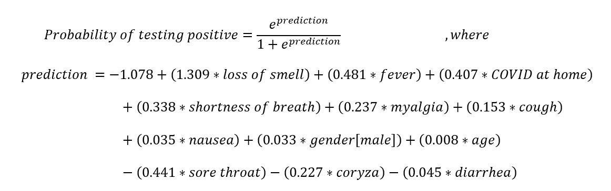

```{r setup, include=FALSE}
knitr::opts_chunk$set(echo = TRUE, warning = FALSE, message = FALSE)
```

## Quem sou eu

-   Bacharelado em Estatística (ENCE, 2013)
-   Mestrado em Eng. Elétrica (PUC-Rio, 2015)
-   Doutorado em Eng. de Produção (PUC-Rio, 2018)
-   Pós-doutorado em Eng. de Produção (PUC-Rio, 2019)
-   Professora Adjunta desde 2019 (DEI, PUC-Rio)

\flushright {width="50%"}

## Me encontre em

-   @paula_macaira
-   github.com/paulamacaira
-   sites.google.com/view/paulamacaira
-   [paulamacaira\@puc-rio.br](mailto:paulamacaira@puc-rio.br){.email}

\flushright {width="40%"}

## Grupos que faço parte

{width="100%"}

## ...

{width="100%"}

## O paper

{width=100%}

## A pandemia de COVID-19 e a importância dos testes

- A pandemia de COVID-19 requeriu extensos programas de testes para entender a transmissão, diagnosticar e isolar os casos positivos

- Dada a alta mortalidade e a ausência de um tratamento específico ou de uma vacina confiável, grandes programas de testes foram parte essencial do controle da epidemia

- A frequência dos testes, no entanto, é muito heterogênea entre os países, no Brasil, as taxas de testagem foram uma das mais baixas\footnote{120.548 testes por um milhão de habitantes, em 02 de dezembro de 2020} no mundo, tornando os sistemas de triagem essenciais para priorizar a testagem

## Objetivo do estudo

Sabendo então da importância da triagem para priorização da testagem para COVID-19, o presente estudo usou a **combinação de sintomas e técnicas de aprendizado de máquina para desenvolver um modelo preditivo** que identifique pessoas e áreas com maior risco de infecção por SARS-CoV-2

## Fonte dos dados

- Este estudo utilizou dados coletados de indivíduos cadastrados no aplicativo "Dados do Bem"\footnote{lançado no Brasil em 28 de abril de 2020}

- Por meio de uma breve pesquisa, o aplicativo coleta:
  + Dados georreferenciados dos usuários inscritos
  + Características demográficas e ocupacionais
  + Sintomas autorreferidos
  + Se o participante é profissional de saúde
  + Se o participante esteve em contato com uma pessoa infectada por SARS-CoV-2

## Interface do aplicativo

{width=100%}

## Como era a priorização...
  
- Antes do estudo, o aplicativo combinava as informações pesquisadas e selecionava indivíduos para teste por meio de alguns critérios de seleção, como por exemplo: **aqueles que haviam sido indicados por um participante previamente testado positivamente tinha a maior prioridade para serem testados, seguidos pelos profissionais de saúde**

## Como o estudo foi desenhado

- Foram incluídos participantes cadastrados no aplicativo desde sua data de lançamento (28 de abril) até 16 de julho de 2020

- Para treinar o modelo, foram selecionados os participantes que responderam ao questionário, fizeram o teste do anticorpo e obteviram um resultado conclusivo (positivo ou negativo)

- Para a identificação das áreas de risco, foram incluídos também os participantes que não haviam sido testados, aplicando o modelo para estimar os resultados de seus testes

## Variáveis e objeto de estudo

- Como o objetivo do estudo foi identificar manifestações clínicas e fatores individuais associados a testes com resultados positivos, as variáveis coletadas e analisadas foram:
  + dados demográficos dos participantes (idade, sexo)
  + sintomas (perda de olfato ou anosmia, febre, mialgia, tosse, náusea, falta de ar, diarreia, coriza e dor de garganta)
  + se o usuário mora junto com alguém com infecção confirmada por SARS-CoV-2
  + resultado do teste de COVID
  
## Desenho do estudo

1. Análise estatística das base de dados
2. Associação entre sintomas (individuais) e resultado do teste (**ajustado por idade e gênero**) através de regressão logística - isto é, 11 modelos, um para cada sintoma - obtendo o Odds Ratio (OR) de cada sintoma
3. Aplicação de **cinco técnicas\footnote{regressão logística (LR) stepwise, Naïve Bayes (NB), Random Forest (RF), Decision Tree usando C5.0 (DT) e eXtreme gradient Boosting} diferentes de aprendizado de máquina**  construir um modelo de previsão que determine, através da combinação de sintomas, a probabilidade de um participante estar infectado por SARS-CoV-2
  + Para tratar o desequilíbrio da variável de resposta (apenas 11,8% são testes positivos) foram avaliadas quatro técnicas diferentes de balanceamento de dados\footnote{Downsampling, Upsampling, Synthetic Minority Oversampling Technique (SMOTE) e Random Over-Sampling Exemplos (ROSE)}
  
## Desenho do estudo

4. Dados foram divididos em conjunto de treinamento (80%) e um conjunto de teste (20%), mantendo a mesma proporção de classes majoritárias e minoritárias entre as subamostras
5. Após obter os melhores hiperparâmetros para cada combinação de modelo e técnica de balanceamento no grupo de treinamento, foi utilizado o Coeficiente de Correlação de Matthew (MCC) para avaliar os resultados nos conjuntos de teste - além do valor de MCC, consideramos a interpretabilidade do modelo para a escolha do modelo final

## Desenho do estudo

6. Por fim, foi avaliada a distribuição dos riscos de infecção por SARS-CoV-2 na área geográfica do Rio de Janeiro modelada como um mapa de grade (cada grade é uma área quadrada de 400m x 400m)
7. Juntamente com os participantes com resultados de testes confirmados, o modelo escolhido foi aplicado à amostra de participantes que ainda não haviam sido testados no período deste estudo para obter o resultado do teste estimado
8. A proporção\footnote{Para evitar interpretações erradas de proporções em grades com dados escassos, foram consideradas apenas grades com pelo menos 10 participantes} de infecções estimadas por SARS-CoV-2 para cada grade foi calculada como:

$$\text{Grade de Risco}= \frac{\text{quantidade de usuários positivos}}{\text{todos os usuários}}$$

## Desenho do estudo

9. Após avaliar a distribuição dos riscos da rede entre todas as redes foram criados cinco grupos de risco usando a média e o desvio padrão (DP) como limites:
  + "muito baixo" (< média-1,5*DP)
  + "baixo " (de média-1,5*SD até média-0,5*SD)
  + "médio" (de média-0,5*SD até média+0,5*SD)
  + "alto" (de média+0,5*SD até média+1,5*SD)
  + "risco muito alto" (>média+1,5*DP)
10. A partir dessa classificação, construímos um mapa de risco para o Rio de Janeiro.

## Validação externa

- O modelo final foi incorporado ao aplicativo em 17 de julho de 2020 e para verificar os ganhos com esse modelo proposto, foi realizada uma validação com os dados do Rio de Janeiro
- Comparamos a proporção de resultados positivos antes da implementação do modelo no aplicativo (usando dados de 15 de junho de 2020 a 16 de julho de 2020) e após sua implementação (usando dados de 01 de agosto de 2020 a 01 de setembro de 2020)\footnote{O intervalo de duas semanas entre a incorporação do modelo no aplicativo e a validação foi necessário, pois ainda havia testes agendados de acordo com a política de priorização anterior}
- Foi avaliado se a média das proporções de resultados positivos antes da implementação do modelo pode ser considerada menor do que a proporção média de resultados positivos após sua implementação através do teste de Wilcoxon

## Disponibilidade dos dados

Os dados e o código utilizados no estudo foram disponibilizados em <https://github.com/noispuc/Dantas_etal_PLOSOne_App-based-symptom>

## Resultados - Análise descritiva da base de dados

{width=100%}
De 28 de abril de 2020 a 16 de julho de 2020, **337.435 indivíduos** registraram seus sintomas por meio do aplicativo Dados do Bem

## Resultados - Odds Ratio dos sintomas

{width=100%}

## Resultados - Combinação de sintomas e modelos

- Para desenvolver um modelo para prever participantes positivos com base no conjunto de dados disponível, foram executadas 25 combinações diferentes de técnicas de aprendizado de máquina e estratégias de amostragem.
- Foram avaliadas comparativamente o desempenho dos modelos no conjunto de teste de acordo com as métricas de Sensibilidade, Especificidade, Predictive Positive Value (PPV), Negative Predictive Value (NPV), F1-Score e MCC

## Resultados - Combinação de sintomas e modelos

{width=100%}

## Resultados - Decisão do modelo final

- O modelo final escolhido foi o método de regressão logística combinado com a estratégia de balanceamento de upsampling

{width=100%}

## Resultados - Performance no grupo de teste

{width=100%}
O modelo prediz corretamente quase todos os testes negativos com apenas 7% de usuários falso-negativos entre os previstos como negativos

## Resultados - Performance no grupo de teste

{width=100%}

## Resultados - Grade de risco

{width=100%}
Aplicamos o modelo preditivo aos 287.714 indivíduos que se registraram no aplicativo (não testados) e 99.431 (34,5%) foram classificados como positivos

## Resultados - Validação externa

- O aplicativo "Dados do Bem" incorporou o modelo final em 17 de julho de 2020, utilizando-o para priorizar usuários para testes em alguns estados brasileiros
- A validação externa com dados do Rio de Janeiro compreendeu 57.762 testes de 01 de agosto a 01 de setembro, resultando em **18,1%** de resultados positivos (10.466/57.762)
- Se considerarmos os dados de 15 de junho a 16 de julho (antes da implantação do modelo), observamos apenas **14,9%** de positividade (5.296/35.626), indicando que o modelo incorporado aumentou a proporção de testes positivos
- Os resultados do teste de hipóteses mostraram diferença estatisticamente significativa entre a proporção de resultados positivos antes e após a implementação do modelo (p-valor < 0,001 com nível de confiança de 95%)

## Conclusões

- O trabalho usou dados sobre sintomas individuais e dados demográficos obtidos de um sistema baseado em aplicativo para prever indivíduos com maior probabilidade de serem infectados por SARS-CoV-2
- Foi desenvolvido um modelo de triagem visando priorizar os usuários para testes e após a aplicação do modelo, dos 57.762 usuários selecionados, 18,1% foram testados positivos
- Essa taxa de positividade foi mais significativa do que a observada sem modelo (14,9%), o que indica que o modelo contribuiu para melhorar a estratégia de teste e selecionar os usuários com maior probabilidade de serem positivos no cenário atual
- Além disso, foi desenvolvido um mapa de risco derivado do modelo, que pode ajudar os tomadores de decisão a localizar regiões com maior risco de testes positivos, permitindo melhores políticas de testagem e controle de doenças

## Inscrições abertas para Mestrado e Doutorado na PUC-Rio

\center {width=70%}